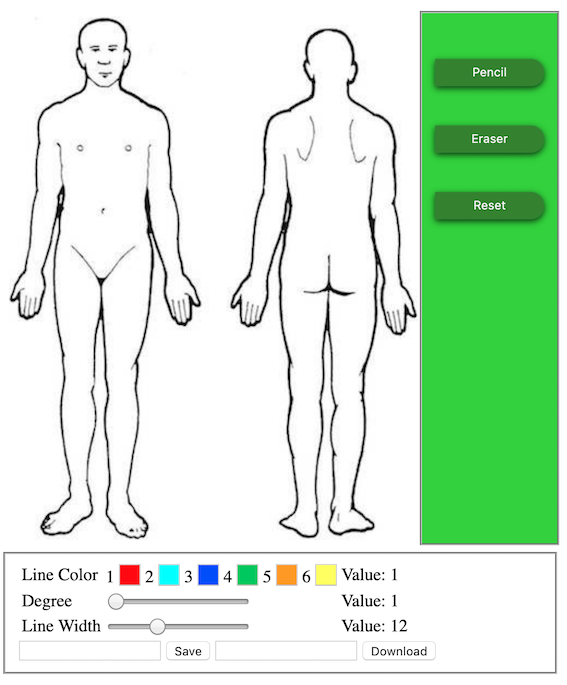

DrawUrPain
=========================

Paint application using Flask, JavaScript.

This project that allows the patient to draw the injured area in arbitrary shape through web GUI.  
This gadget will calculate the percentage of total skin area to assist some medical researches. 

  

Although there some Apps also provide coverage calculation, they are not totally free or just suuport fixed shape only.
This app will use different to differentiate the kinds of injure and give the index to each one. Try it now!
